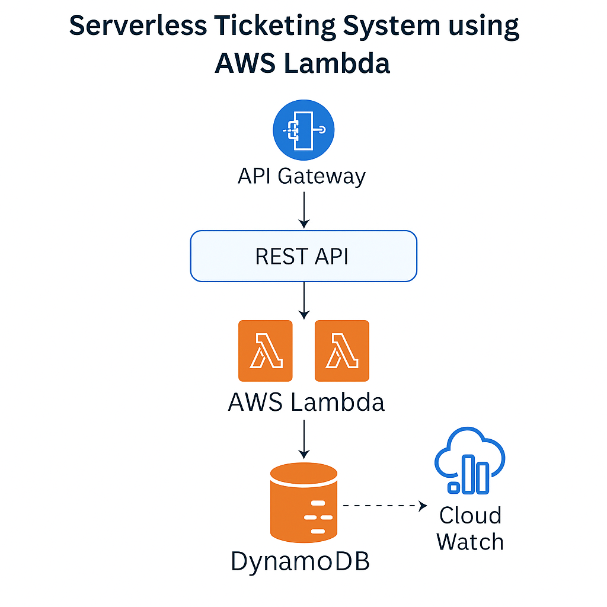

# Serverless Ticketing System using AWS Lambda

## 🚀 Project Overview
A serverless support ticketing system built with AWS Lambda, API Gateway, and DynamoDB. Users can create, view, and update support tickets through a REST API. The project follows an event-driven architecture and is highly scalable.

## 🧱 Architecture Diagram

## 🛠️ Technologies Used
- AWS Lambda (Python - Boto3)
- API Gateway (REST APIs)
- Amazon DynamoDB
- Amazon SNS (for email alerts)
- IAM Roles & Policies
- Amazon CloudWatch (Logs & Monitoring)

## 🔧 Key Features
- Serverless and fully managed architecture
- Create, update, fetch support tickets via REST APIs
- Ticket data stored in DynamoDB with TTL
- Email alert sent on ticket creation using SNS
- Logs and metrics captured in CloudWatch

## 📁 Folder Structure
